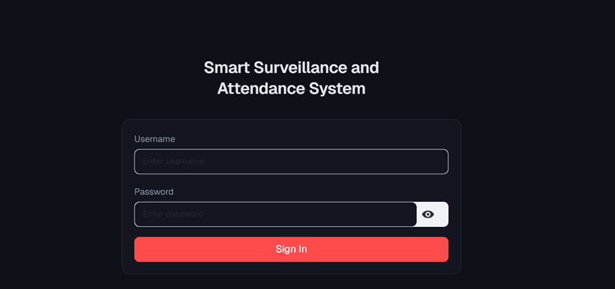
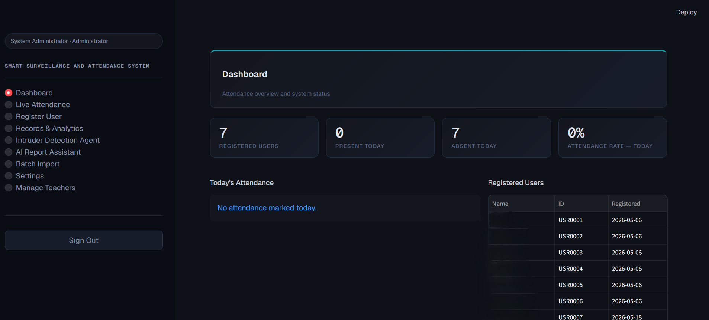
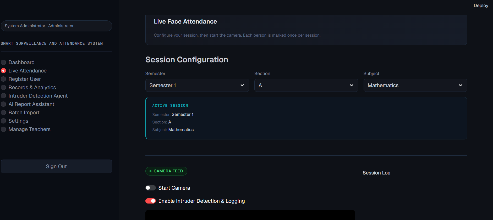
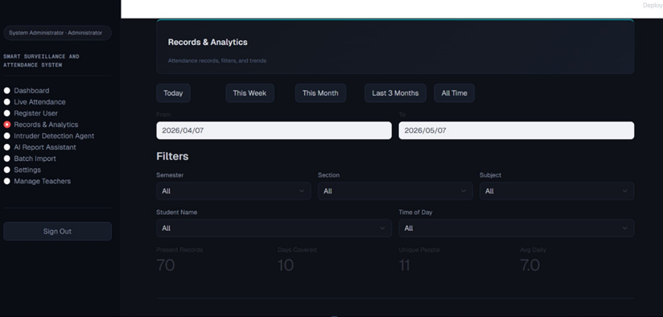
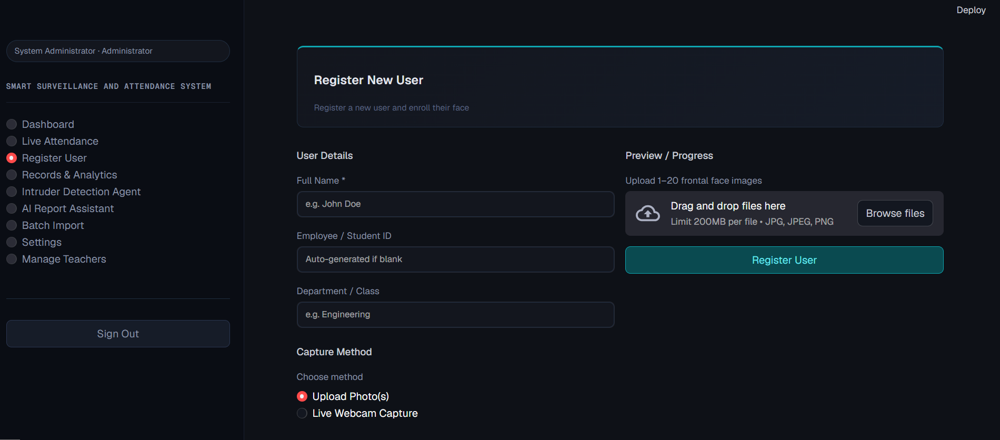
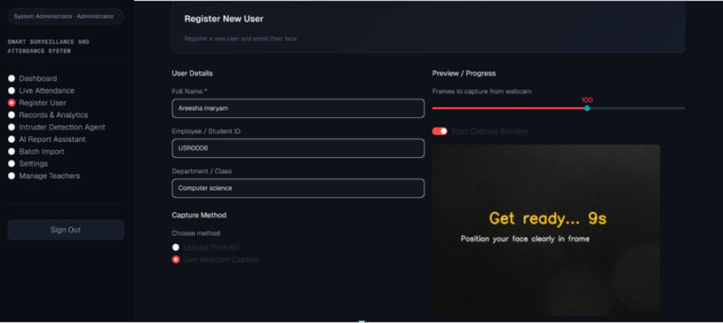
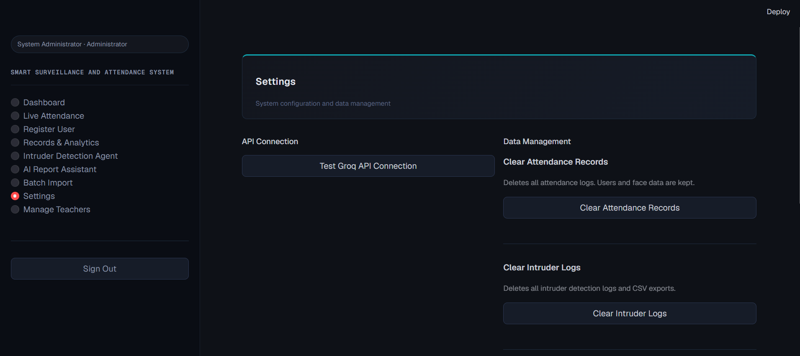
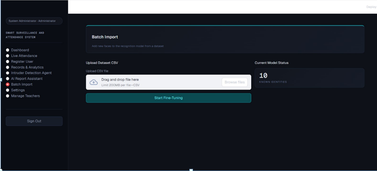

# Smart Surveillance & Attendance System

> A real-time face recognition system for automated attendance tracking and intruder detection — built as a Final Year Project.

---

## Developed By
**Areesha Maryam**
Final Year Project — BS Computer Science

---

## About The Project

Traditional attendance systems are slow, error-prone, and easy to manipulate. This system solves that by using **real-time face recognition** to automatically mark attendance through a webcam — no manual input needed.

It also detects **unknown faces (intruders)** and logs them instantly, making it suitable for both classrooms and secure environments.

---

## Features

- **Secure Login** — Admin authentication system
- **Live User Registration** — Register new users in real-time using webcam face enrollment
- **Live Face Recognition** — Real-time webcam-based detection
- **Auto Attendance Marking** — Marks present/absent automatically
- **Intruder Detection** — Flags and logs unknown faces instantly
- **Analytics Dashboard** — Attendance stats and trends
- **AI Report Assistant** — Chat with your attendance data using LLaMA 3.3
- **Attendance Records** — View and manage full attendance history
- **Batch Import** — Add new faces via CSV dataset
- **Export Reports** — Download attendance as CSV
- **Settings** — Manage users, clear data, test API connection

---

## Built With

| Technology | Purpose |
|---|---|
| Python | Core language |
| Streamlit | Web UI framework |
| InsightFace | Face recognition engine |
| OpenCV | Camera & image processing |
| Groq + LLaMA 3.3 | AI report assistant |
| Pandas | Data management |
| ONNX Runtime | Model inference |

---

## Installation & Setup

### 1. Clone the repository
```bash
git clone https://github.com/areeshamaryam/Smart-Surveillance-And-Attendance-System.git
cd Smart-Surveillance-And-Attendance-System
```

### 2. Create a virtual environment
```bash
python -m venv venv
venv\Scripts\activate
```

### 3. Install dependencies
```bash
pip install -r requirements.txt
```

### 4. Set up your API key
Create a `.env` file in the project folder:
```
GROQ_API_KEY=your_groq_api_key_here
```
Get your free key at: https://console.groq.com

### 5. Run the app
```bash
streamlit run app.py
```

---

## Default Login Credentials

| Username | Password | Role |
|---|---|---|
| admin | admin123 | Admin |

> You can change the password from inside the app after logging in.

---

## Project Structure

```
Smart-Attendance-System/
│
├── app.py                  # Main application
├── requirements.txt        # Dependencies
├── .gitignore              # Files excluded from GitHub
├── .env                    # API keys (not uploaded)
└── screenshots/            # App screenshots
```

---

## Screenshots

| Login | Dashboard | Live Attendance |
|-------|-----------|-----------------|
|  |  |  |

| Intruder Detection | Attendance Records | Register User |
|--------------------|--------------------|---------------|
|  |  |  |

| Register Step 2 | AI Report Agent | Settings |
|-----------------|-----------------|----------|
|  |  |  |

| Batch Import |
|-------------|
|  |

---

## Requirements

- Python 3.10
- Webcam
- Groq API key (free)

---

## Note

This project requires `insightface` which works best on **Windows with Python 3.10**.
Make sure to install the correct version:
```
pip install insightface==0.7.3 onnxruntime==1.23.2
```

---

*Built as a Final Year Project*
